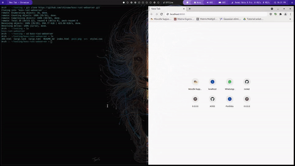

# koss-rust-webserver #
A simple Webserver in rust-- WITHOUT USE OF ANY FRAMEWORKS

## Demo-Preview ##

## Installation and setup ##
please refer to my previous webserver using rocket framework [https://github.com/chinsaw/rocket-web-koss]

Everything is same except you don't need to enable rust nightly for this.

### Screenshot ###

